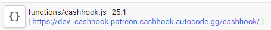

# CashHook for Patreon

## What is CashHook? 

CashHook is a simple to use and swift setup webhook tool for Ko-Fi, BuyMeACoffee and Patreon. CashHook is a project built for MLH event - The Hackconomist. CashHook was made with the intention of making it easier for creators to make sure their community and monetary supporters feel recognised for what they do.

## How do I use it?

CashHook on Autocode is made to be simple, you can follow the flow to add the correct variables and link a Discord bot (which Autocode will guide you through) to ensure that you're all connected and from there you're set to go! 

## Does it cost to use CashHook?

CashHook is free and open source, meaning there are no fees to use CashHook, however we would really appreciate any donations to our [Ko-Fi page](https://ko-fi.com/cashhook)!

## How do I get my CashHook link in Autocode?

Locating your CashHook is simple, just take a look to the bottom of the page in the autocode editor, your unique CashHook will appear like this: 

## How do I add my CashHook to Patreon?

To register your CashHook on Patreon, simply head to [the Patreon webhook dashboard](https://www.patreon.com/portal/registration/register-webhooks)  and paste your CashHook as your chosen webhook! You will then need to turn on any specific options the CashHook should receive data for, this CashHook works best with `Create Member` options active.